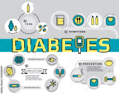

# Análise estatística de base de dados de diabetes

A FAZER  faça um texto explicando o contexto



## Organização do projeto

Modelo de projeto de ciência de dados para ser utilizado como referência em projetos
futuros. Desenvolvido por mim, [Francisco Bustamante](https://github.com/chicolucio),
para alunos iniciantes em ciência de dados de meus cursos e mentorias.

Inspiração: [Cookiecutter Data Science](https://drivendata.github.io/cookiecutter-data-science/)

Clique no botão **Use this template** para criar um novo repositório com base neste modelo.

## Organização do projeto

```
├── .gitignore         <- Arquivos e diretórios a serem ignorados pelo Git
├── ambiente.yml       <- O arquivo de requisitos para reproduzir o ambiente de análise
├── LICENSE            <- Licença de código aberto (MIT)
├── README.md          <- README principal para desenvolvedores que usam este projeto.
|
├── dados              <- Arquivos de dados para o projeto.
|
|
├── notebooks          <- Cadernos Jupyter.
│
|   └──src             <- Código-fonte para uso neste projeto.
|      │
|      ├── __init__.py  <- Torna um módulo Python
|      ├── config.py    <- Configurações básicas do projeto
|      └── estatistica.py  <- Funções criadas especificamente para este projeto
|
├── referencias        <- Dicionários de dados.
|
├── imagens         <- Imagem utilizada no projeto.
```

## Configuração do ambiente

1. Faça o clone do repositório que será criado a partir deste modelo.

    ```bash
    git clone ENDERECO_DO_REPOSITORIO
    ```

2. Crie um ambiente virtual para o seu projeto utilizando o gerenciador de ambientes de sua preferência.
      ```bash
      conda env export > ambiente.yml
      ```

## Um pouco mais sobre a base

[Clique aqui](referencias/01_dicionario_de_dados.md) para ver um dicion[ario de dados da base utilizado

## Resumo dos principais resultados

A FAZER 

